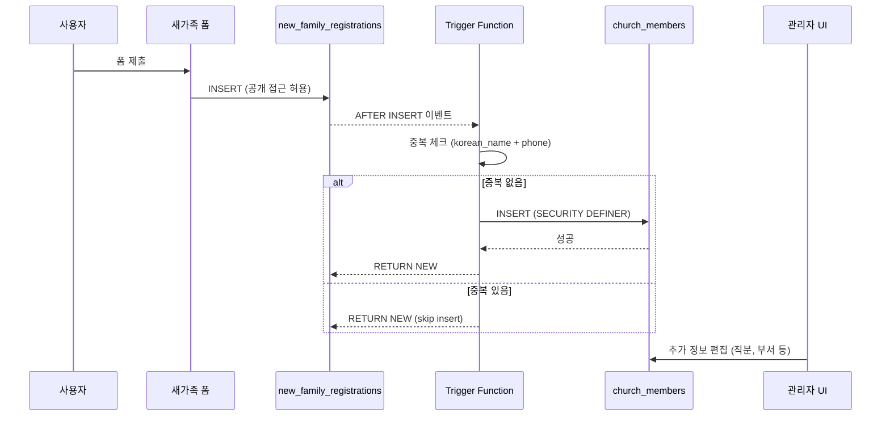

# System Design Document: 새가족 자동 교인 등록

**Feature**: Auto Church Member Registration
**Version**: 2.9.0
**Date**: 2026-02-09
**Author**: System
**Status**: ✅ Implemented

---

## 1. 개요 (Overview)

### 1.1 문제 정의 (Problem Statement)

기존 시스템에서 새가족 등록 폼(`new_family_registrations`)을 제출하면 데이터가 저장되지만, 교인 명부(`church_members`)에는 자동으로 등록되지 않았습니다. 관리자가 수동으로 "교인으로 전환" 작업을 수행해야 했습니다.

**기존 플로우**:
```
새가족 폼 제출 → new_family_registrations (INSERT)
                     ↓
              [관리자 수동 작업 필요]
                     ↓
              church_members (수동 INSERT)
```

**문제점**:
- 관리자 수작업 필요 (시간 소모, 누락 가능성)
- 새가족과 교인 데이터 불일치
- 중복 등록 위험 (같은 사람을 두 번 등록)

### 1.2 해결 방안 (Solution)

Postgres **AFTER INSERT 트리거**를 사용하여 새가족 등록 시 자동으로 교인 명부에 등록합니다.

**새로운 플로우**:
```
새가족 폼 제출 → new_family_registrations (INSERT)
                     ↓ (Postgres Trigger - 자동)
              church_members (자동 INSERT)
                     ↓
              [관리자는 추가 정보만 편집]
```

**장점**:
- ✅ 완전 자동화 (관리자 개입 불필요)
- ✅ 데이터 일관성 보장
- ✅ 중복 방지 로직 내장
- ✅ 기존 데이터 backfill 지원

---

## 2. 아키텍처 (Architecture)

### 2.1 시스템 컴포넌트

```
┌─────────────────────────────────────────────────────────────┐
│                    Frontend Layer                            │
│  (Public Form: /new-family-registration)                     │
└──────────────────────┬──────────────────────────────────────┘
                       │ HTTP POST
                       ▼
┌─────────────────────────────────────────────────────────────┐
│                 Supabase Client Layer                        │
│  - Insert into new_family_registrations                      │
│  - RLS: Allow anonymous insert                               │
└──────────────────────┬──────────────────────────────────────┘
                       │ INSERT event
                       ▼
┌─────────────────────────────────────────────────────────────┐
│              Postgres Trigger Layer                          │
│  - Trigger: trigger_auto_register_member                     │
│  - Function: auto_register_church_member()                   │
│  - Execution: SECURITY DEFINER (bypass RLS)                  │
│  - Logic:                                                    │
│    1. Check duplicate (korean_name + phone)                  │
│    2. Insert into church_members                             │
│    3. Map fields (address merge, gender convert, etc.)       │
└──────────────────────┬──────────────────────────────────────┘
                       │ INSERT success
                       ▼
┌─────────────────────────────────────────────────────────────┐
│              church_members Table                            │
│  - Status: 'active'                                          │
│  - Member Type: 'member'                                     │
│  - RLS: Require authentication (admins only)                 │
└─────────────────────────────────────────────────────────────┘
```

### 2.2 트리거 함수 (Trigger Function)

**함수명**: `auto_register_church_member()`
**실행 권한**: `SECURITY DEFINER` (함수 소유자 권한으로 실행, RLS 우회)
**트리거 이벤트**: `AFTER INSERT ON new_family_registrations`

**핵심 로직**:

```sql
CREATE OR REPLACE FUNCTION auto_register_church_member()
RETURNS TRIGGER AS $$
BEGIN
  -- 1. 중복 체크 (같은 이름 + 전화번호)
  IF EXISTS (
    SELECT 1 FROM church_members
    WHERE korean_name = NEW.korean_name
    AND phone = NEW.phone
  ) THEN
    RAISE NOTICE 'church_members에 이미 존재: % (%)', NEW.korean_name, NEW.phone;
    RETURN NEW;
  END IF;

  -- 2. church_members에 자동 INSERT
  INSERT INTO church_members (
    korean_name, english_name, email, phone, address,
    birth_date, gender, member_type, baptized, baptism_date, status
  ) VALUES (
    NEW.korean_name,
    NEW.english_name,
    NEW.email,
    NEW.phone,
    CONCAT_WS(', ', NULLIF(TRIM(NEW.address1), ''), ...), -- 주소 합치기
    NEW.birth_date,
    CASE WHEN NEW.gender IN ('male', 'female') THEN NEW.gender ELSE NULL END,
    'member',
    COALESCE(NEW.baptism_date IS NOT NULL, false),
    NEW.baptism_date,
    'active'
  );

  RETURN NEW;
END;
$$ LANGUAGE plpgsql SECURITY DEFINER;
```

**SECURITY DEFINER의 필요성**:
- `church_members` 테이블은 RLS(Row Level Security)로 보호됨
- 비인증 사용자는 직접 INSERT 불가능
- 트리거 함수는 함수 소유자(admin) 권한으로 실행하여 RLS 우회

### 2.3 트리거 정의

```sql
CREATE TRIGGER trigger_auto_register_member
  AFTER INSERT ON new_family_registrations
  FOR EACH ROW
  EXECUTE FUNCTION auto_register_church_member();
```

---

## 3. 데이터 흐름 (Data Flow)

### 3.1 신규 등록 플로우



### 3.2 기존 데이터 Backfill 플로우

마이그레이션 파일(`20260209_auto_register_church_member.sql`)에 포함된 Backfill 쿼리:

```sql
-- 기존 new_family_registrations 중 church_members에 없는 데이터 일괄 등록
INSERT INTO church_members (...)
SELECT ...
FROM new_family_registrations nfr
WHERE NOT EXISTS (
  SELECT 1 FROM church_members cm
  WHERE cm.korean_name = nfr.korean_name
  AND cm.phone = nfr.phone
);
```

---

## 4. 필드 매핑 (Field Mapping)

### 4.1 필드 매핑 테이블

| new_family_registrations | church_members | 변환 규칙 |
|--------------------------|----------------|-----------|
| `korean_name` | `korean_name` | 직접 매핑 |
| `english_name` | `english_name` | 직접 매핑 |
| `email` | `email` | 직접 매핑 |
| `phone` | `phone` | 직접 매핑 (중복 체크 키) |
| `address1`, `address2`, `city`, `state`, `zip_code` | `address` | **CONCAT_WS(', ', ...)** - 쉼표로 합치기 |
| `birth_date` | `birth_date` | 직접 매핑 |
| `gender` | `gender` | **CASE**: 'male'/'female'만 허용, 나머지 NULL |
| - | `member_type` | 고정값: **'member'** |
| `baptism_date` | `baptized` | **계산**: `baptism_date IS NOT NULL` |
| `baptism_date` | `baptism_date` | 직접 매핑 |
| - | `status` | 고정값: **'active'** |

### 4.2 주소 합치기 로직

```sql
CONCAT_WS(', ',
  NULLIF(TRIM(NEW.address1), ''),   -- 빈 문자열 제거
  NULLIF(TRIM(NEW.address2), ''),
  NEW.city,
  NEW.state,
  NEW.zip_code
)
```

**예시**:
- Input: `address1="123 Main St"`, `address2=""`, `city="Los Angeles"`, `state="CA"`, `zip_code="90001"`
- Output: `"123 Main St, Los Angeles, CA, 90001"`

### 4.3 성별(Gender) 변환

```sql
CASE WHEN NEW.gender IN ('male', 'female') THEN NEW.gender ELSE NULL END
```

**이유**: `church_members.gender`는 `'male'`, `'female'`, `NULL`만 허용 (다른 값 방지)

### 4.4 세례 여부(Baptized) 계산

```sql
COALESCE(NEW.baptism_date IS NOT NULL, false)
```

**로직**: 세례일이 있으면 `true`, 없으면 `false`

---

## 5. 중복 방지 전략 (Duplicate Prevention)

### 5.1 중복 체크 기준

**기준**: `korean_name` + `phone` 조합

**이유**:
- 이름만으로는 부족 (동명이인 가능)
- 전화번호만으로는 부족 (가족 공유 번호 가능)
- **이름 + 전화번호** 조합은 실질적으로 유니크함

### 5.2 트리거 레벨 중복 방지

```sql
IF EXISTS (
  SELECT 1 FROM church_members
  WHERE korean_name = NEW.korean_name
  AND phone = NEW.phone
) THEN
  RAISE NOTICE 'church_members에 이미 존재: % (%)', NEW.korean_name, NEW.phone;
  RETURN NEW;  -- INSERT 건너뜀
END IF;
```

**동작**:
- 중복 발견 시 `church_members` INSERT 건너뜀
- `new_family_registrations`는 정상 저장 (히스토리 보존)
- NOTICE 로그 남김 (디버깅용)

### 5.3 애플리케이션 레벨 중복 방지

관리자가 수동으로 "교인으로 전환" 버튼을 누를 때도 동일한 체크 필요:

```typescript
// src/utils/newFamilyService.ts
export const convertToChurchMember = async (newFamilyId: string) => {
  // 1. 새가족 데이터 조회
  const newFamily = await getNewFamilyById(newFamilyId)

  // 2. 중복 체크
  const { data: existing } = await supabase
    .from('church_members')
    .select('id')
    .eq('korean_name', newFamily.korean_name)
    .eq('phone', newFamily.phone)
    .single()

  if (existing) {
    throw new Error('이미 교인 명부에 등록된 분입니다.')
  }

  // 3. INSERT
  // ...
}
```

---

## 6. 보안 및 권한 (Security & Permissions)

### 6.1 RLS 정책 (Row Level Security)

#### new_family_registrations 테이블

```sql
-- 공개 폼이므로 비인증 사용자도 INSERT 가능
CREATE POLICY "allow_anonymous_insert" ON new_family_registrations
  FOR INSERT
  WITH CHECK (true);

-- SELECT는 관리자만 가능
CREATE POLICY "admin_select" ON new_family_registrations
  FOR SELECT
  USING (auth.role() = 'authenticated' AND is_admin(auth.uid()));
```

#### church_members 테이블

```sql
-- 모든 작업은 인증된 관리자만 가능
CREATE POLICY "admin_all" ON church_members
  FOR ALL
  USING (is_admin(auth.uid()))
  WITH CHECK (is_admin(auth.uid()));
```

### 6.2 SECURITY DEFINER의 중요성

트리거 함수는 `SECURITY DEFINER`로 실행되어 RLS를 우회합니다:

```
비인증 사용자 → new_family_registrations INSERT (허용됨)
                        ↓
               Trigger Function (SECURITY DEFINER)
                        ↓ (함수 소유자 권한으로 실행)
               church_members INSERT (성공!)
```

**주의사항**:
- `SECURITY DEFINER` 함수는 SQL Injection에 취약할 수 있음
- 본 함수는 `NEW.*` 값만 사용하므로 안전함 (사용자 입력 직접 사용 안 함)

---

## 7. 마이그레이션 (Migration)

### 7.1 마이그레이션 파일

**파일명**: `supabase/migrations/20260209_auto_register_church_member.sql`

**포함 내용**:
1. 트리거 함수 생성 (`auto_register_church_member()`)
2. 트리거 등록 (`trigger_auto_register_member`)
3. 기존 데이터 Backfill (중복 제외)
4. new_family_registrations 상태 업데이트 (`status = 'registered'`)

### 7.2 Backfill 쿼리

```sql
INSERT INTO church_members (...)
SELECT ...
FROM new_family_registrations nfr
WHERE NOT EXISTS (
  SELECT 1 FROM church_members cm
  WHERE cm.korean_name = nfr.korean_name
  AND cm.phone = nfr.phone
);
```

**결과**: 기존 새가족 등록 중 아직 교인으로 등록되지 않은 분들을 일괄 등록

### 7.3 상태 업데이트

```sql
UPDATE new_family_registrations nfr
SET status = 'registered'
WHERE status != 'registered'
AND EXISTS (
  SELECT 1 FROM church_members cm
  WHERE cm.korean_name = nfr.korean_name
  AND cm.phone = nfr.phone
);
```

**목적**: Backfill된 항목의 상태를 `'registered'`로 변경하여 관리자 UI에서 구분 가능

---

## 8. 영향 분석 (Impact Analysis)

### 8.1 변경된 컴포넌트

| 컴포넌트 | 변경 내용 | 영향도 |
|----------|-----------|--------|
| **Database** | 트리거 함수 추가 | 🔴 High |
| **new_family_registrations** | 자동 처리 로직 추가 | 🟡 Medium |
| **church_members** | 자동 INSERT 추가 | 🟡 Medium |
| **Admin UI** | 수동 전환 버튼 유지 (중복 방지 추가) | 🟢 Low |
| **Public Form** | 변경 없음 | - |

### 8.2 기존 기능에 미치는 영향

✅ **새가족 폼 제출**: 변경 없음 (트리거가 자동 실행)
✅ **관리자 수동 전환**: 여전히 작동 (중복 체크로 안전)
✅ **교인 명부 조회**: 변경 없음
⚠️ **Backfill**: 일회성 작업 (마이그레이션 시 자동 실행)

### 8.3 성능 고려사항

- **트리거 오버헤드**: 각 INSERT마다 추가 쿼리 1개 (중복 체크) + INSERT 1개
- **예상 성능 영향**: 미미함 (새가족 등록은 저빈도 작업)
- **인덱스**: `church_members(korean_name, phone)` 복합 인덱스 권장

---

## 9. 테스트 시나리오 (Test Scenarios)

### 9.1 정상 시나리오

| 시나리오 | 예상 결과 |
|----------|-----------|
| 새로운 새가족 등록 | new_family_registrations + church_members 모두 INSERT |
| 이미 등록된 사람 재등록 | new_family_registrations만 INSERT, church_members는 skip |
| 세례일 있는 사람 | `baptized = true`, `baptism_date` 저장됨 |
| 세례일 없는 사람 | `baptized = false`, `baptism_date = NULL` |

### 9.2 엣지 케이스

| 시나리오 | 예상 결과 |
|----------|-----------|
| 주소 필드 일부 비어있음 | CONCAT_WS로 빈 값 제외하고 합침 |
| gender가 'other'인 경우 | church_members에 NULL로 저장 |
| phone이 같지만 이름 다름 | 별도 레코드로 등록 (중복 아님) |
| 이름이 같지만 phone 다름 | 별도 레코드로 등록 (중복 아님) |

---

## 10. 모니터링 및 로깅 (Monitoring & Logging)

### 10.1 로그 확인

Postgres 로그에서 트리거 실행 확인:

```sql
-- Supabase Dashboard → Database → Logs
-- 또는 직접 쿼리
SELECT * FROM pg_stat_statements
WHERE query LIKE '%auto_register_church_member%';
```

### 10.2 중복 감지 알림

트리거가 중복을 감지하면 `RAISE NOTICE` 로그 남김:

```
NOTICE: church_members에 이미 존재: 홍길동 (010-1234-5678)
```

### 10.3 통계 쿼리

```sql
-- 오늘 자동 등록된 교인 수
SELECT COUNT(*)
FROM church_members
WHERE created_at >= CURRENT_DATE;

-- 최근 1주일 신규 등록 추이
SELECT DATE(created_at) AS date, COUNT(*) AS count
FROM church_members
WHERE created_at >= CURRENT_DATE - INTERVAL '7 days'
GROUP BY DATE(created_at)
ORDER BY date DESC;
```

---

## 11. 롤백 절차 (Rollback Procedure)

마이그레이션 롤백이 필요한 경우:

```sql
-- 1. 트리거 제거
DROP TRIGGER IF EXISTS trigger_auto_register_member ON new_family_registrations;

-- 2. 함수 제거
DROP FUNCTION IF EXISTS auto_register_church_member();

-- 3. (선택) 자동 등록된 데이터 제거 (주의!)
-- DELETE FROM church_members WHERE created_at >= '2026-02-09';
```

**주의**: 자동 등록된 데이터를 삭제하면 복구 불가능합니다. 백업 필수!

---

## 12. 향후 개선 사항 (Future Enhancements)

### 12.1 Short-term

- [ ] `church_members(korean_name, phone)` 복합 인덱스 추가
- [ ] 관리자 UI에 "자동 등록됨" 배지 표시
- [ ] 중복 감지 시 이메일 알림 (선택)

### 12.2 Long-term

- [ ] 트리거 실행 통계 대시보드
- [ ] 새가족 → 교인 전환 히스토리 테이블
- [ ] 중복 의심 케이스 자동 리뷰 시스템

---

## 13. 참고 자료 (References)

- **Migration File**: `supabase/migrations/20260209_auto_register_church_member.sql`
- **Test Document**: `DOCS/features/auto-member-registration-TDD.md`
- **Admin UI**: `src/pages/admin/new-families/index.tsx`
- **Supabase Triggers**: https://supabase.com/docs/guides/database/postgres/triggers
- **SECURITY DEFINER**: https://www.postgresql.org/docs/current/sql-createfunction.html

---

**문서 작성일**: 2026-02-09
**마지막 업데이트**: 2026-02-09
**문서 상태**: ✅ Complete
